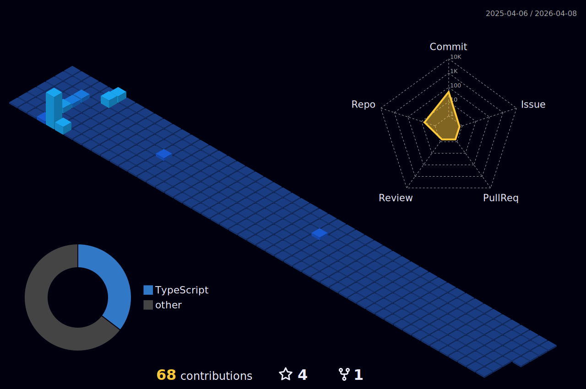

# Willi Humphreys

Sou um desenvolvedor com foco em criar soluções eficientes e escaláveis, atualmente me especializando em **desenvolvimento mobile com React Native**. Tenho experiência sólida no desenvolvimento full stack e estou sempre em busca de novos desafios que expandam meu conhecimento técnico e profissional.

Atualmente curso **Engenharia de Software na Universidade Mogi das Cruzes (UMC)**, o que me proporciona uma base acadêmica forte para aliar teoria à prática no desenvolvimento de sistemas.

## Tecnologias que domino

  
  
  
  
  
  
  
  
  
  
  

## Em evolução constante

Estou comprometido em aprimorar minhas habilidades técnicas e contribuir com projetos que promovam impacto real. Meus principais objetivos envolvem:

- Aprofundar minha expertise em **aplicações mobile com React Native**
- Consolidar práticas de desenvolvimento escalável e performático
- Colaborar em projetos open source e profissionais

---

Repositórios em destaque logo abaixo mostram um pouco da minha trajetória de aprendizado e atuação prática.  
Para mais informações técnicas, acesse qualquer um dos projetos listados ou entre em contato via [meu LinkedIn](https://www.linkedin.com/).

